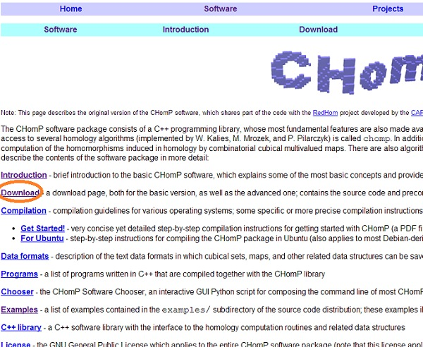
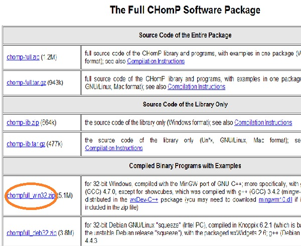
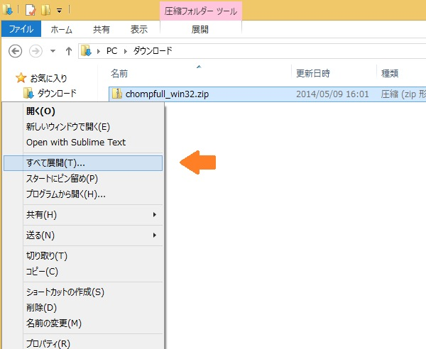
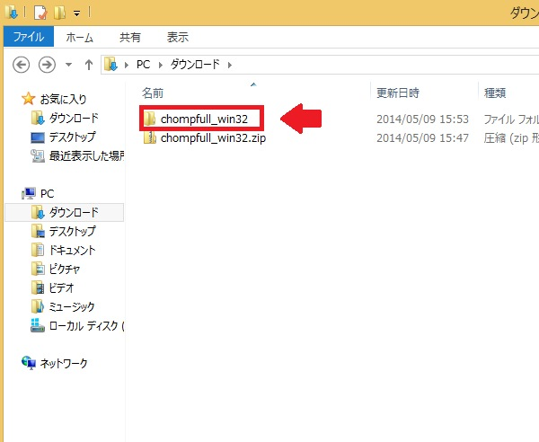
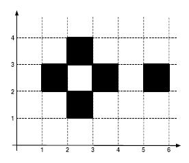
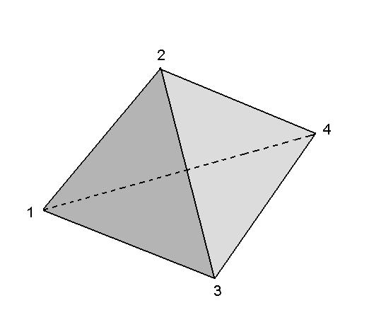
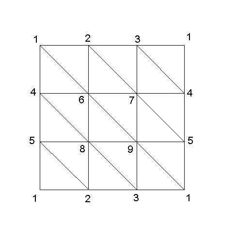
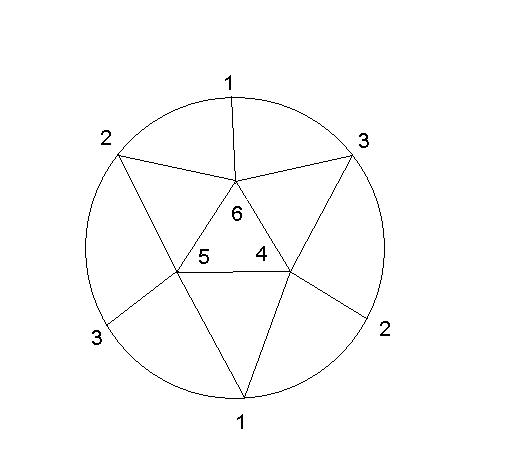
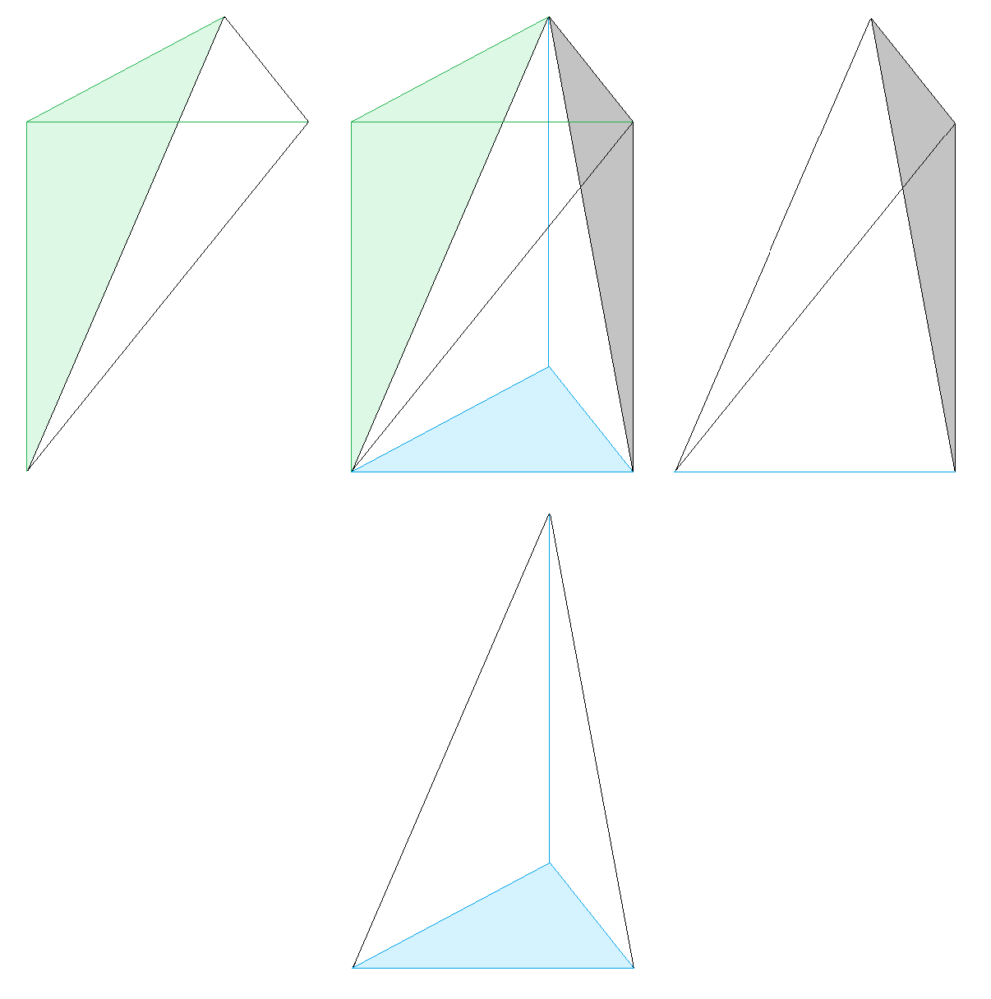

# CHomP

## 1. 目標

この実習の目標は，計算機と数学応用プログラムを用いて，実用性を確認することにあります．

単体的ホモロジーは組み合わせ的であり，計算機との相性が良いです．
空間を三角形分割して，単体的ホモロジーの計算を行うのですが，ここでは立体分割と三角形分割を用いて
ベッチ数，ホモロジーの計算をしてみましょう，
プログラムで計算する前に，自分でホモロジーの計算をしてみてください．

## 2. 導入方法

ソフトウェア CHomP は，http://chomp.rutgers.edu/Projects/Computational_Homology/OriginalCHomP/software/ より入手することができます．

1. リンク先の Download をクリックします．

   

2. 下のほうにある "The Full CHomp Software Package"の"Compiled Binary Programs with Examples" の中から，一番上にある ”chompfull_win32.zip” をクリックし，保存します．

   

3. ダウンロードしたフォルダを開き，"chompfull_win32.zip" を右クリックして「すべて展開」をクリックします．

   

4. 図のように， "chompfull_win32" があれば準備完了です．

   

## 3. データファイルの構成

CHomP を実際に使って，ホモロジーの計算をしてみましょう．
コンパイルをするための，データファイルを構成します．ホモロジーを計算するにあたり，空間を”分割”しておく必要があります．
ここでは，立体と単体による2通りの分割の仕方を用いたファイルの構成方法を，具体例を通して説明します．

_ただし，コマンドが分割の仕方を指定しているので注意しましょう．_
例えば，ベッチ数を計算する「chomp」コマンドは，データファイルを自動的に立体分割のデータであると認識します．
一方で，ホモロジーを計算する「homsimpl」コマンドは，データファイルを自動的に単体的分割として読み込みます．
立体分割した空間のデータファイルを使って，「homsimpl」コマンドを適用することはできません．
（正確には，コンパイルはできますが．一般に間違った計算結果が表示されます．）
したがって．目的に併せて，空間の分割の仕方を変えていく必要があります．

まずは，立体 (cube) により分割された空間を扱ってみます．
入力ファイルには，空間を分割する立体の頂点の座標を記述します．
ただし，立体は8頂点を持ちますが，1頂点のみを用いて立体の位置を記述します．

**例1．**



メモ帳を開き，次のようにデータを入力します．ファイル名は，「example1.txt」として，準備した chompfull_win32 内のディレクトリ bin に保存してください．

```
(1,2)
(2,1)
(3,2)
(2,3)
(5,2)
```

空間を立体分割として記述するときは，頂点の座標を （ ） で括ります．

実際のホモロジーの計算では，立体分割で与えるよりも三角形分割を与える方が簡単であることが多いです．
そこで，実際に三角形分割が与えられている空間のホモロジーの計算を行ってみましょう．

**例2．**



上の単体複体は，2−単体から構成されているとします．この単体複体のファイルを構成します．メモ帳を開き，次のようにデータを入力します．
ファイル名は，「example2.txt」として，インストールした chompfull_win32 内のディレクトリ bin に保存してください．

```
{1,2,3}
{1,2,4}
{1,3,4}
{2,3,4}
```

単体複体のデータとしては，包含関係に関して極大な単体のみをすべて記述します．
各単体の頂点集合を `{ }` で括って記述します．

構成した二つのファイルを用いて，具体例のベッチ数とホモロジーの計算を行ってください．

## 4. コンパイル方法

**例1のコンパイル方法**

例1について，ベッチ数の計算をしてみましょう．ベッチ数を計算するコマンドは `chomp` です．コマンドプロンプトを開き，現在いるディレクトリを，先に example1.txt を保存した bin まで移動させます．そして，

```
chomp example1.txt
```

と記述することで，出力 "`2 1 0`" を得ます．これがこの例1に対するベッチ数となります．

ほかのデータファイルでも，3. と同様の過程を経て， chomp のあとに，計算したいデータを入力したファイル名を記述すれば，ベッチ数の計算結果が出力されます．

**例2のコンパイル方法**

単体複体のホモロジー計算については， `homsimpl` というコマンドを用いて計算することができます．例1のコンパイル方法と同様にコマンドプロンプトを開き，現在いるディレクトリを，先に example2.txt を保存した bin まで移動させます．そして，

```
homsimpl example2.txt
```

と記述することで，出力

```
H_0 = Z
H_1 = 0
H_2 = Z
```

を得ます．

ほかのデータファイルでも，3．と同様の過程を経て， `homsimpl` のあとに，計算したいデータを入力したファイル名を記述すれば，各ホモロジー群の計算結果が出力されます．

**おまけ**

1つの複体 cpx.txt と部分複体 subcpx.txt を準備しておけば，相対ホモロジーを計算することもできます．コマンドは

```
homsimpl cpx.txt subcpx.txt
```

です．部分複体や相対ホモロジーの意味がわかる人は，こちらもやってみましょう．


## 5. 演習問題

(1) - (4)は単体分割を自分で作ってホモロジー群を計算してください．その際，下の図を参考にしてみましょう．
(5)はページ下部の添付ファイルを使用して，コンパイルします．答えは各自検索してください．

(1) 2次元トーラス  
(2) 2次元実射影空間  
(3) 正二十面体  
(4) 3次元トーラス  
(5) 2次元複素射影空間


(1) 貼り合わせで2次元トーラスができることを確認する



(2) 貼り合わせで実射影平面ができることを確認する



(4) (1)とこの絵をヒントに，3次元トーラスの分割を考える


