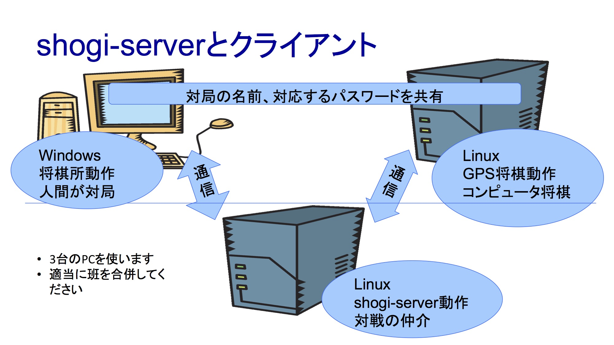

# shogi-serverによる将棋対戦

## 概要
shogi-serverは、ネットワークを介した将棋の対局を実現するためのサーバプログラムです。
コンピュータ将棋協会が規定したTCP/IP上のCSAサーバプロトコルに対応しています。
Rubyで書かれ、GPLで配布されています。
詳しくは
http://shogi-server.sourceforge.jp/
を見てください。

## クライアント
CSAサーバプロトコルに対応したクライアントとして、ここでは
* 将棋所 http://www.geocities.jp/shogidokoro/

を扱います。

また、コンピュータ将棋のソフトウェアである
* GPSshogi http://gps.tanaka.ecc.u-tokyo.ac.jp/gpsshogi/

も使ってみます。

shogi-serverのページにはその他のクライアントも紹介されていますので試してみてください。

## 構成
上記のソフトウェアはいずれもLinuxでもWindowsでも動かせますが、この実習では次のOSでの実行を推奨します。
以下では推奨OSでの実行例を記載します。

|ソフトウェア|OS|
|---|---|
|shogi-server|Linux|
|将棋所       |Windows|
|GPSshogi    |Linux|


２班が協力して、PCを３台使って実行することを推奨します。shogi-serverに１台、２人（？）のクライアントにそれぞれ１台を割り当てます。
絵で表すと下のようになります。



shogi-serverとGPSshogiを同じコンピュータに割り当て、将棋所をもう１台にすることで、２台のPCで実行することもできなくはありません。

## shogi-serverのインストールと実行
Linuxを起動し、端末ウィンドウを開きます。

### rubyとgitをインストール
```
$ sudo apt-get install ruby git
```

### shogi-serverのソースコードをダウンロード
gitでソースコードをダウンロードします。
あらかじめ[githubへのアクセス](github.md)にある準備を行っておきます。
```
$ git clone git://git.sourceforge.jp/gitroot/shogi-server/shogi-server.git
```

もしgitがうまく動かないなら、下のリンクからファイルをダウンロードし、tarコマンドで展開する。
http://git.sourceforge.jp/view?p=shogi-server/shogi-server.git;a=snapshot;h=HEAD;sf=tgz

### shogi-serverを実行
```
$ cd shogi-server
$ ruby shogi-server test 4081
```
* "TCPServer Error: Address already in use - bind(2)"という警告が出るかもしれないが気にしなくてよい
* `test`は識別用の文字列で、アルファベットの１単語なら他の文字列でもよい。
* 4081はTCPのポート番号。

以上で将棋クライアントソフトからの接続を待つ状態になっています。

別の端末ウィンドウで
```
$ ps -ef
$ ss -at
```
を実行し、
* shogi-serverのプロセスが動作していること
* TCP port 4081がLISTENの状態になっていること

を確認しておいてください。
```
$ ip a
```
で、shogi-serverが動作しているコンピュータのIPアドレス（インターフェイスenp0??のinetアドレス）を確認します。
実行例では192.168.11.11とします。

## GPSshogiのインストールと実行
Linuxを起動し、端末ウィンドウを開きます。

### GPSshogi関係ソフトウェアダウンロード
以下のリンクからダウンロードします。
* http://gps.tanaka.ecc.u-tokyo.ac.jp/cgi-bin/viewvc.cgi/trunk/osl.tar.gz?view=tar
* http://gps.tanaka.ecc.u-tokyo.ac.jp/cgi-bin/viewvc.cgi/trunk/gpsshogi.tar.gz?root=gpsshogi&view=tar

### ファイルの展開
```
$ tar zxf osl-osl.tar.gz
$ tar zxf gpsshogi-gpsshogi.tar.gz
```
必要なソフトウェアのインストール
```
$ sudo apt-get install g++ libboost-all-dev libcppunit-dev
$ sudo apt-get install clang
```
おまじない
```
$ (cd osl; ln -s ../gpsshogi/data)
```
問：（）でくくっているのはなぜか。

### コンパイル
oslはg++でコンパイルするとエラーが出るので、clangを使います。
そのため、`osl/makefile.conf`の最初の2行
```
CXX = c++ -std=c++11 -DOSL_SMP
GXX = c++ -std=c++11 -DOSL_SMP
```
を以下のように書き換えます。
```
CXX = clang++ -std=c++11 -DOSL_SMP
GXX = clang++ -std=c++11 -DOSL_SMP
```
makeコマンドを使ってコンパイルします。
```
$ (cd osl; make -j 4)
$ (cd gpsshogi/bin; make -j 4)
```
※もし”makeがない”と言われたら、apt-getコマンドを使ってインストールする。

問：makeの"-j"オプションについて調べよ。数字は４でなくてもよい。いくつが最適か。

### テスト
```
$ (cd gpsshogi/bin; ./gpsshogi --benchmark; ./gpsusi --benchmark)
```
エラーが出なければ多分大丈夫。

### shogi-serverに接続
```
$ cd gpsshogi/bin
$ SHOGIUSER=gps SHOGIPASS=gps GAMENAME=gps-1500-0 SERVER=192.168.11.11 ./rb_network_x1.rb
```
IPアドレスは自分で調べておいたものにおきかえてください。
`GAMENAME`と`SHOGIPASS`で対局を指定します。`SHOGIUSER`は自分の名前を表します。（いずれも適当な文字列に置き換えて可。ただし、`GAMENAME`と`SHOGIPASS`は対局する他のクライアントでも同一にすること）

## 将棋所のインストールと実行
Windowsを起動します。

### ダウンロードとインストール
* http://www.geocities.jp/shogidokoro/download.html
の「将棋所4.0.2をダウンロード」からファイルをダウンロードし、zipファイルを展開。
* フォルダにあるアプリケーションShogidokoroをダブルクリックし、起動。

## 対局の開始
* 将棋所を起動し、「対局」→「サーバ通信対局」を選ぶ。
* 「接続」の項目に以下を入力。
    * 接続先　192.168.11.11（自分のshogi-serverのアドレスに置き換え）
    * ログイン　user1（GPSshogiのSHOGIUSERと異なっていれば何でも良い）
    * パスワード　gps-1500-0,gps（GPSshogiで指定したGAMENAMEとSHOGIPASSを","でつないで入力）
* 「OK」すると対局が始まります。あなたはGPSshogiに勝てるでしょうか。

## プロトコルの観察
対局中にWiresharkを起動してどのようなデータがやり取りされているかを観察してみましょう。

## コンピュータ同士の対局
将棋所の「サーバ通信対局」の画面で、「こちら側の対局者」を「エンジン」に変えると将棋所側をコンピュータ将棋ソフトに指させることができます。

デフォルトでは将棋所付属のLesserkaiが選択されます。

※もし「エンジン」が選択不可になっていたら、「対局」→「エンジン管理」でエンジンを追加します。Lesserkaiはパッケージに同梱されています。

## GPSshogi同士の対戦
将棋所のエンジンとしてGPSshogi（Windows版）を指定することもできます。Windows版についてはGPSshogiのページから情報を探してください。

また、将棋所を使わないで、一つ目のGPSshogiの設定と同様にもう一つ別のGPSshogiを起動して（SHOGIUSERは別のものを指定）GPSshogi同士の対戦をさせることも可能です。ただしこの場合対局がどのように進んでいるかを人の目で確認するのはなかなか難しいでしょう。

## References
### 全体に参考にしたもの
* Linuxサーバー、はじめの“一歩” http://itpro.nikkeibp.co.jp/article/Watcher/20130605/482641/
将棋所をLinuxで実行する例も出ています。（記事全文を読むにはユーザー登録が必要かも）
* shogi-server
http://shogi-server.sourceforge.jp/
* GPSshogi
http://gps.tanaka.ecc.u-tokyo.ac.jp/gpsshogi/
Windows版についても記載があります。
* 将棋所
http://www.geocities.jp/shogidokoro/
