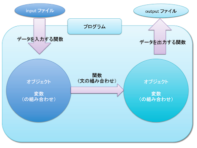

# Perl入門

０．過去のマニュアル

１．Perlとは：

２．さっそくプログラムを作ってみましょう！

コードを書くコツはこちら：良いコードを書くために（TODO: 内容をコピーする）

PerlはUnixであると自称するほとんどすべてのシステムに入っていると言われています。
unixのターミナルを起動して、

```
perl -v
```

と入力してみてください。入っていればバージョンが確認されるはずです。
入っていない場合については割愛しますが、perl.orgなどを調べてみましょう。





## プログラムファイルの作成と実行　

１）メモ帳などのエディタを立ち上げ、プログラムを書き、ファイルに名前を付けて保存します。

ファイル名は『ファイル名.pl』とします。(`.pl` はperlのファイルの拡張子です。)
まずは練習として下のようなプログラムを書き、
ファイル名を `hello.pl` としてみましょう。保存場所を覚えておきます。
（今回はDesktopの `perl_lessons` というフォルダに保存してみましょう。）

```perl
use strict;   #文法のチェックをしてくれます
use warnings;  #危険な書き方をすると警告をしてくれます。

print ("Hello world!\n");

# comment!

=pod

you
can
add
long
comment
here!

=cut
```

```perl
print ("コマンドライン上に表したい文字");
```

で、コマンドライン上に変数の中身を表示させることができます。（詳細後述。）

２）プログラムをunix上で実行します。

まずプログラムファイルを保存するディレクトリに移動します。
unixをたちあげて、

```
cd ディレクトリへのパス
```

を入力します。

今回はDesktopの `perl_lessons`というフォルダに保存しているので、

```
cd Desktop/perl_lessons
```

と入力します。 その後、

```
perl プログラム名.pl
```

とコマンドを入力し、プログラムを実行します。今回は

```
perl hello.pl
```

ですね。


## プログラムの構成要素


１）変数の種類

Perlで使われる変数には次の３種類があります。

* a) スカラー
* b) 配列
* c) ハッシュ

また、それぞれの変数は、中身にアクセスできる範囲（スコープ）があります。
その変数を含む範囲｛｝内のみからアクセスできる変数をローカル変数といい、
プログラムのどこからでもアクセスできる変数をグローバル変数といいます。

ローカル変数はあたまに `my` をつけて宣言し、
グローバル変数はあたまに `our` をつけて宣言することで区別されます。
（今回は全てローカル変数として宣言することにします。）

では、具体的に3種類の変数をみていきましょう。


a) スカラー：ひとつの数字または文字列。※線形代数で使われるスカラーとは違います。

プログラム中では

```perl
my $変数名;
```

として宣言します。セミコロンは行の終わりを示す記号ですが、よく忘れるので気をつけましょう。
また、変数名の付け方にも色々なコツがありますので調べてみてくださいね！

値の代入の仕方は主に2通りあります。

```perl
my $number = 1;
```

または

```perl
my $string;
$string = "I'm string!";
```

です。
スカラーを利用して `hello.pl` を改良したプログラムを書いてみます。

```perl
use strict;
use warnings;

my $Greeting = "Hello World!\n";       # " "で文字列を表すこともできるし
my $AnotherGreeting = 'Hello World!\n';  # ' 'で文字列を表すこともできますが、

print ($Greeting);
print ($AnotherGreeting);

#QUIZ!!!!
#結果の違いがわかるかな？
```

QUIZの答え。

文字列は、 `" "` で囲んで表した場合、特殊文字（エスケープシーケンス）が使えます。

`' '` で囲んで表した場合、特殊文字は使えず、そのまま表示されています。
エスケープシーケンスについては、次のリンクを参照してください。

b) 配列：スカラーの組。文字列と数字が混ざっていてもよい。

```perl
my @配列の名前;
```

として宣言出来ます。値の代入の仕方はスカラーと同じです。

では、 `hello.pl` を改良してみましょう。

```perl
use strict;
use warnings;

my $Greeting = "Hello World!";       # " "で文字列を表すこともできるし
my $AnotherGreeting = 'Hello World!';  # ' 'で文字列を表すこともできますが、

my @Array1 = ("Hi!\t", "Yeah!\n");       #\tと\nは特殊文字。\tはタブ。\nは改行
my @Array2 = ($Greeting, $AnotherGreeting);  #スカラーで宣言しても良い。

print (@Array1);
print (@Array2);
print ("\n");                       #見やすくするために改行を入れました。
print ($Array1[0], $Array1[1], $Array2[1], "\n");

#配列の要素にアクセスするには、$配列名[要素の場所]を書きます。
#この場合、取り出した値は配列ではないので、$が先頭に付くことに注意します。
#1つ目の要素の場所は0,2つめの要素の場所は1,..となります。

=pod

QUIZ!!
Array1のプリント結果と
Array2のプリント結果を見比べて、気づいたことはありますか？

=cut
```

QUIZの答え。

配列をプリントすると、各要素の間にスペースが入っていないことに気づきます。
コンピューターは指示した通りにしか動きませんので、
見やすくするために空気を読んでスペースを空けてくれたりはしないのです。
いちいち面倒ですが、見やすくするためにスペース(`"\ "`)やタブ(`"\t"`)を入れるようにしましょう。
上のプログラムには値に改行やタブを含んでいますが、基本的には入れないように！
（今回はデモにつき、見やすくするために入れました。）

※文字列を代入するときに毎回 `"　"` を付けるのが面倒なときは

```perl
@変数名= qw/hello hi howareyou/;
```

というようにスペースで区切る方法もあります。

c) ハッシュ：キー（データのラベルのようなもの）と値の組みあわせで表される変数。

色々なタイプのデータをまとめて管理するときに便利です。
Perlで特徴的なデータ形式はハッシュです。宣言するときには頭に `%` を付けます。

```perl
my %ハッシュの名前;
```

では例によってhello.plを改良してみましょう。

```perl
use strict;
use warnings;

my @Greeting = ("How are you?", "What's up?!", "Namaste!");

my %People = (" HARU: "=>$Greeting[0], " BOB: "=>$Greeting[1], " Indian: "=> $Greeting[2]);

#ハッシュへの代入は、 "キー"=>値　として行います。

#今回、キーには見やすくするためにキーにスペースなどを入れました。
#あとの関数のところで値に特殊文字を入れない方法をお教えします！

print (%People, "\n", @Greeting, "\n");
print ("\n");

=pod

QUIZ!!
ハッシュをプリントした時と配列をプリントした時、
どんな違いが見つかりますか？

=cut
```

QUIZの答え。

ハッシュがプリントされる順番は、値を代入したときの順番と違うこと。

以上で、変数についてはおしまいです。


２）アルゴリズムの構成要素

単純な論理構造（制御構造）と演算、関数を組み合わせて、より複雑なアルゴリズムを作成します。

A) 制御構造

a) 繰り返し

* i) while 文：条件を満たす間、命令を実行し続ける。
* ii) for 文：指定した繰り返しの回数命令を実行する。
* iii) foreach 文（Perlに特徴的）：配列やハッシュの要素の数だけ命令を実行する。

b) 条件分岐

* i) if 文：場合分けをして命令を実行する。else ifはPerlでは　**elsif**　と記述する。

c) 変数の制御

B) 演算子

a) 四則演算、その他

`+`, `-`, `*`, `/`, `%`, `**` : 足し算、引き算、かけ算、割り算、割り算した余り、べき乗

b) 比較演算子

数字の比較：

`>`, `<`, `>=`, `<=`, `==`, `!=`：(前半省略)、等号、不等号

文字の比較：（言語ごとに違いあり。）

`eq`, `ne`, `gt`, `ge`, `lt`, `le`, `cmp`：さしあたって最初の２つ、等しい、等しくないだけ覚えればよいです。

c) 論理演算子

`&&`, `||`, `!` ：AND, OR, NOT

上で書かれるような基本的な論理構造や演算子は他の言語ともほぼ同じです。詳しくはこちら。

C) 関数：変数に対してある変換を施すもの。

`print (変数);` は最もよく使われる関数の１つですが、

print : 変数　→　コマンドライン上に変数の値を表示

として定義される関数です。
また、各プログラミング言語が標準的に備えている関数はバラエティに富んでいて
そのプログラミング言語の特徴や強みをよく表しています。

また、作成したアルゴリズムをまとめて自作の関数を（同じファイル内に）作ったり、
違うファイルにまとめてモジュールを作ることができます。
Perlはモジュールが充実していて、他の人が作ったモジュールをダウンロードし、
使用することができます。詳しくは　CPAN　モジュール　で調べてみてください。


実際に `hello.pl` を改良しながら勉強しましょう。

```perl
use strict;
use warnings;

my @Greeting = ("How are you?", "What's up?!", "Namaste!");
my @Key = ("HARU", "BOB", "RAMANUJAN");
my $i=0;                            #初期値の代入。繰り返しに使われる変数名はi, jが多いです。
                                    #数学書と同じですね。
#    while(条件){
#        命令;
#    }

    while($i<3){
        print ($Greeting[$i], "\n");
        $i++;                           #$iの数を1つ増やす。
    }

#   for(初期値;終了条件;一回につき増やす値){
#        命令;
#   }

my %People;
    for($i=0; $i<3; $i++){
        $People{$Key[$i]}    =  $Greeting[$i];    #ハッシュにキーと値をそれぞれ代入。
        #whileのように{ }の中で$iを増やす必要はありません。
    }

#    foreach $取り出した要素を一旦格納する変数  (配列またはハッシュ){
#        命令;
#    }

my $tmp;    #一次的な変数
    foreach $tmp(keys(%People)){          #ハッシュのキーを取り出します。
        print ($tmp, " : ", $People{$tmp}, "\n");
    }
    foreach $tmp(@Greeting){          #配列の場合は値が取り出されます。
        print ($tmp,"\n");
    }
```

少しアドバンストな内容も含めて。

```perl
use strict;
use warnings;

my @Greeting = ("How are you?", "What's up?!", "Namaste!");
my @Key = ("HARU", "BOB", "RAMANUJAN");
my @Number = (1..100);    #1..100として1から100までという代入ができます。
my $i=0;
my ($tmp, $sum,$area,$x, $t) = (0, 0, 0, 0, 0);            #一行にまとめて宣言することも出来る。初期値は0

#   if(条件){
#       命令;
#   }elsif(条件){
#       命令;
#   }else{
#       命令;
#   }
#
for($i=0;$i<3;$i++){
    if($Key[$i] eq "HARU"){
        print ($Key[$i], " said ", $Greeting[$i], "\n");
    }elsif($Key[$i] ne "RAMANUJAN"){
        print ($Key[$i], " is not RAMANUJAN!! \n", );
    }else{
        print ("I AM ", $Key[$i], "!! \n");
    }
}

foreach $tmp(@Number){
    if($tmp%2 == 1){            #2で割った余りが1ならば、
        $sum = $sum + $tmp;     #$sumに$tmpを足して出た値を$sumに代入して新しい$sumの値とする。
    }
}

print ("sum = ", $sum, "\n");
#面積(の近似値)を求めてみることもできます。
my $T = 10000;
my $dx = 1/$T;

while($t<$T){
    $area = $area + ($dx * ($x**2 + ($x+$dx)**2))/2;
    $x = $x + $dx;
    $t++;
}
print ("area among y = x^2, y>0, [0,1] is about ", $area, "\n");
```

```
$ perl hello.pl
HARU said How are you?
BOB is not RAMANUJAN!! 
I AM RAMANUJAN!! 
sum = 2500
area among y = x^2, y>0, [0,1] is about 0.333333334999943
```

３）課題に挑戦！

置換σを巡回置換の積で表せ。

Python入門の最終課題と同じものを課題として出します。
言語の違いを感じてみてください。

ハッシュを使わず配列だけでといてみました。

```perl
use strict;
use warnings;

#置換σを巡回置換の積に分解する
#σ(x) = (1,2,3,0, 5,6,7,4)とする。
#σ = (0,1,2,3)(4,5,6,7)が答え。

my @ArrayX = (0,1,2,3,4,5,6,7);
my @ArraySIGMAX = (1,2,3,0,5,6,7,4);
my @Flag = (1,1,1,1,1,1,1,1);
my $i;

my $Tmp = 0;
my @TmpList;
my $count = 8;

while ($count>0){
    if($Flag[$Tmp]!=0){
        print ($Tmp, "\ ");
        $Flag[$Tmp] = 0;
        $Tmp = $ArraySIGMAX[$Tmp];
    }else{
        print ("\n");
        for($i=0;$i<8;$i++){
            if($Flag[$i]>0){
                $Tmp = $i;
                $i+= 8;
            }
        }
    }
    $count --;
}
print("$Tmp\n");
```

```
$ perl cycle.pl
0 1 2 3 
4 5 6 7
$ 
```

文責：根上春
