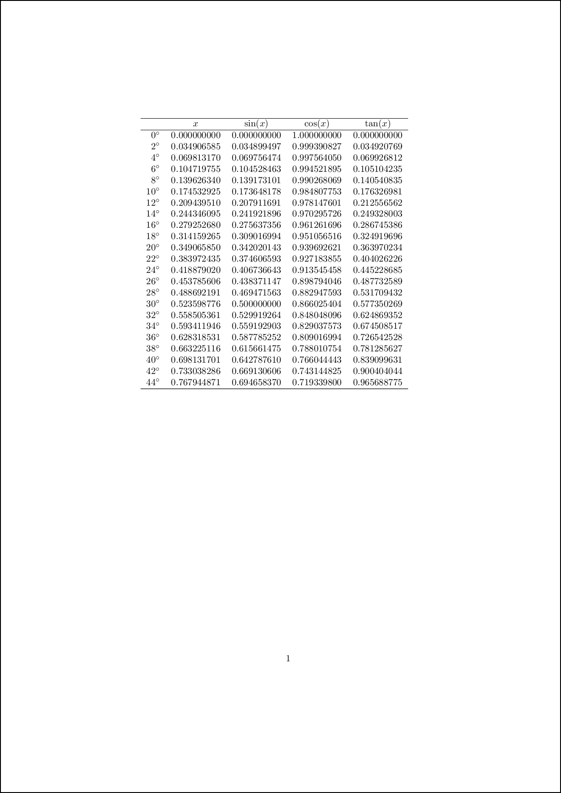
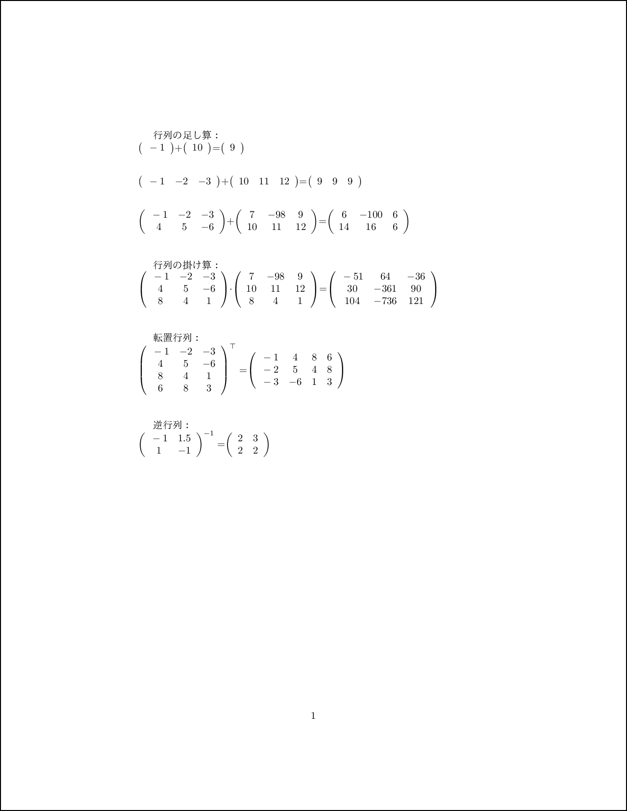

# LuaLaTeX 入門
LuaTeX は 軽量で組み込み可能なスクリプト言語 Lua が使える
TeX エンジンである。

普通のLaTeXに比べて、主な特徴が以下のようになる：
1. pdf への直接出力(pdfTEX の後継)
1. Unicode への対応(SIP 内の文字も余裕)
1. TrueType/OpenType フォントの直接利用
1. Lua スクリプトで TEX 内部処理のカスタマイズが可能

## 例１: 基本的な例
```tex
\documentclass{article}
\usepackage{luatexja} %%日本語を有効にするため
\usepackage{luacode}

\begin{document}
標準近似
$$\pi = \directlua{tex.sprint(math.pi)}...$$
\end{document}
```

## 例２: 三角関数とstring.format
```tex
\documentclass{article}
\usepackage{luacode}
\directlua{dofile('luacode2.lua')}
\newcommand{\trigtable}{\directlua{trigtable()}}

\begin{document}
    \begin{tabular}{rcccc}
    \hline
    & $x$ & $\sin(x)$ & $\cos(x)$ & $\tan(x)$ \\
    \hline
    \trigtable
    \hline
    \end{tabular}
\end{document}
```
luacode2.lua:
```lua
function trigtable ()
	for t=0, 45, 2 do
	local x=math.rad(t)
	tex.print(string.format(
		[[%2d$^{\circ}$ & %1.9f & %1.9f & %1.9f & %1.9f \\]],
		t, x, math.sin(x), math.cos(x), math.tan(x)))
	end
end
```

## 例３: 基本的な線形代数
```tex
\documentclass{article}
\usepackage{xparse}
\usepackage{fontspec}
\usepackage{luacode}
\usepackage{luatexja} %%日本語を有効にするため

\directlua{dofile('luacode3.lua')}
\ExplSyntaxOn
\NewDocumentCommand{\matrixadd}{mm}{\directlua{matradd("#1","#2")}}
\NewDocumentCommand{\matrixmult}{mm}{\directlua{matrmult("#1","#2")}}
\NewDocumentCommand{\matrixtransp}{m}{\directlua{matrtransp("#1")}}
\NewDocumentCommand{\matrixinv}{m}{\directlua{matrinv("#1")}}
\ExplSyntaxOff

\begin{document}
行列の足し算：\\
\matrixadd{(-1)} {( 10)}
\matrixadd{(-1, -2, -3)} {( 10, 11, 12)}
\matrixadd{(-1, -2, -3)(4, 5, -6)}{(7, -98, 9) (10, 11, 12)}

行列の掛け算：\\
\matrixmult{(-1, -2, -3)(4, 5, -6)(8, 4, 1)} {(7, -98, 9) (10, 11, 12)(8, 4, 1)}

転置行列：\\
\matrixtransp{(-1, -2, -3)(4, 5, -6)(8, 4, 1)(6, 8, 3)}

逆行列：\\
\matrixinv{(-1,1.5)(1,-1)}
\end{document}
```
luacode3.lua:
```lua
local suffix = "\\\\[2em]"
local matrix = require 'matrix' --ここでmatrix.luaが使う
function matradd (mat1, mat2)
    m1 = matrix{unpack(CreateMatrix(mat1))}
    m2 = matrix{unpack(CreateMatrix(mat2))}
    m3 = matrix.add(m1,m2)

    tex.sprint( matrix.latex(m1,c).."+")
    tex.sprint( matrix.latex(m2,c).."=")
    tex.sprint( matrix.latex(m3,c)..suffix)
end
function matrmult (mat1, mat2)
    m1 = matrix{unpack(CreateMatrix(mat1))}
    m2 = matrix{unpack(CreateMatrix(mat2))}
    m3 = matrix.mul(m1,m2)

    tex.sprint( matrix.latex(m1,c).."\\cdot")
    tex.sprint( matrix.latex(m2,c).."=")
    tex.sprint( matrix.latex(m3,c)..suffix)
end
function matrtransp (mat1)
    m1 = matrix{unpack(CreateMatrix(mat1))}
    m2 = matrix.transpose(m1)

    tex.sprint( "${\\mbox{"..matrix.latex(m1,c).."}}^\\top=$")
    tex.sprint( matrix.latex(m2,c)..suffix)
end
function matrinv (mat1)
    m1 = matrix{unpack(CreateMatrix(mat1))}
    m2 = matrix.invert(m1)

    tex.sprint( "${\\mbox{"..matrix.latex(m1,l).."}}^{-1}=$")
    tex.sprint( matrix.latex(m2,l)..suffix)
end
function CreateMatrix(str)
    rows={}

    -- get the elements between the braces
    -- and execute the following function
    string.gsub(str, "%((.-)%)",
        function(sub)
            -- for debugging
            --tex.print("Row: "..sub.."\\\\")
            -- split the string at ','
            elements = string.explode(sub,",")
            row={}
            for i,e in ipairs(elements) do
                -- remove spaces (not really necessary)
                e = string.gsub(e," ","")
                -- insert the element to the row-table
                table.insert(row,e)
                -- for debugging
                --tex.print("Element :"..e.."\\\\")            
            end
            -- insert the row-table to the rows-table
            table.insert(rows,row)
        end
    )

    return rows
end
```
その例をコンパイルするため、matrix.luaが必要である。そのファイルが以下のリンクでダウンロードできる：
<https://github.com/davidm/lua-matrix/blob/master/lua/matrix.lua>

## 参考文献
1. LuaLaTeXに関するスライド (日本語) <https://docs.google.com/presentation/d/1njfGyC8qnunf9OzGz3wqpDuzdJVI3ed7j8B6oXO5bts/edit?usp=sharing>
1. A guide to LuaLaTeX (英語) <http://dante.ctan.org/tex-archive/info/luatex/lualatex-doc/lualatex-doc.pdf>
1. Numerical methods with LuaLaTeX (英語) <http://www.unirioja.es/cu/jvarona/downloads/numerical-methods-luatex.pdf>
1. LuaTeX Reference (英語) <http://www.luatex.org/svn/trunk/manual/luatex.pdf>
